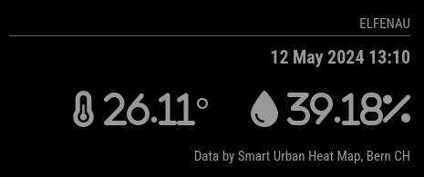

# MMM-SwissSmartUrbanHeatMap

MMM-SwissSmartUrbanHeatMap allows you to view climatic data from stations of the measuring network [Smart Urban Heat Map Bern](https://smart-urban-heat-map.ch/)
(temperature & humidity) on your [MagicMirror²](https://github.com/MichMich/MagicMirror/).



*Data is provided by [Smart Urban Heat Map Project Bern, Switzerland](https://smart-urban-heat-map.ch/)*

## Installation

```shell
cd ~/MagicMirror/modules
```

Clone the repository:
```shell
git clone https://github.com/git-pesche/MMM-SwissSmartUrbanHeatMap
```

Configure the module in your `config.js`:
```js
modules: [
  {
    module: 'MMM-SwissSmartUrbanHeatMap',
    position: 'top_right',
    header: 'Elfenau Bern',
    config: {
      city: '11025',
      humidity: 'vertical',
    }
  },
]
```


## Configuration Options

| Option           | Description                                                                                                                                      |
|------------------|--------------------------------------------------------------------------------------------------------------------------------------------------|
| city             | Location of the measuring station to display the temperature & humidity. (possible values see: https://smart-urban-heat-map.ch/api/v2/stations) |
| humidity         | Layout to show humidity with ('vertical', 'horizontal' or 'none')                                                                                |
| updateIntervalMs | How often the module should update itself (every 15min by default)                                                                               |
